<div align="center">



> 흩어진 Claude Code 운영 자산을 한 화면에서 다루는 데스크톱 콘솔


</div>

스킬 · 에이전트 · 워크플로 · 메모리 · MCP · 훅 · 세션 · 비용을 **15개 모듈**로 나눠 읽고, 고치고, 되돌립니다. 별도 DB·동기화 계층 없이 **원본 파일을 직접** 읽고 씁니다.

## 왜 필요한가

Claude Code의 운영 자산은 홈 디렉터리 아래 흩어진 파일입니다 — 스킬은 폴더마다 `SKILL.md`, 메모리는 마크다운, MCP·훅·권한은 제각각 JSON. 무엇이 설치됐는지 보려면 에디터, 동작 확인은 CLI, 비용은 또 다른 경로를 뒤져야 했습니다. **CCM은 이 파일들을 읽고 · 고치고 · 되돌리는 한 곳으로 모읍니다.** 편집은 원본 파일에 그대로 반영됩니다.

| 질문 | 답하는 모듈 |
|---|---|
| 무엇이 있나 | `SKILLS` · `AGENTS` · `WORKFLOWS` · `MCP` 설치 목록·활성 상태 |
| 왜 안 되나 | `DIAGNOSTICS` — 설정 충돌·깨진 참조 지목 |
| 얼마나 썼나 | `COST` — 모델별·일자별 집계 |
| 되돌리려면 | `SNAPSHOTS` — 설정 전체 시점 보관 |

## 🧩 15 모듈



## ✨ 하이라이트

- **MEMORY Link Graph** — `[[위키 링크]]`를 파싱해 힘 기반(force-directed) 레이아웃으로 배치하고 *연결됨 · 오타 · 미작성* 3색으로 구분. 오타(고칠 것)와 미작성(써야 할 것)을 나눠 보여줍니다.
- **WORKFLOWS** — 스크립트를 파이프라인 도식으로 펼치고, `LIVE` 탭 실시간 모니터 · `SAFETY` 탭 실행 범위 제한을 GUI로 통제.
- **HARNESS & SNAPSHOTS** — 실행 트리·저장소·보존 정책을 보여주고, 설정 전체를 시점 단위로 묶어 복원.
- **COST & DIAGNOSTICS** — 모델·일자·세션별 비용 집계 + 설정 충돌·깨진 참조 탐지.



<sub>WORKFLOWS 모듈이 워크플로 스크립트를 펼쳐 보여주는 파이프라인 도식. 위 단계 이름은 실제 `redteam-triage` 워크플로의 phase입니다.</sub>

## 🎯 설계 원칙

- **파일이 곧 진실** — 중간 캐시가 아닌 원본을 직접 읽고 씀
- **되돌릴 수 있게** — `SNAPSHOTS` 시점 복원
- **상태가 보이게** — 활성·비활성·오류를 목록에서 즉시 구분
- **읽는 화면은 가볍게** — 모듈 전환 시 불필요한 재스캔 차단

## 🛠 기술 스택

| | |
|---|---|
| **Stack** | .NET 8 · WPF |
| **Pattern** | MVVM |
| **Typeface** | Press Start 2P · VT323 · IBM Plex Sans KR |
| **Distribution** | 단일 실행 파일 · GitHub Release |

## ⬇️ 다운로드

최신 빌드는 [Releases](../../releases)에서 받을 수 있습니다. 자체 포함 단일 실행 파일이라 .NET 런타임 설치가 필요 없습니다.

빌드는 `.\build\publish.ps1` 로 `dist\ClaudeCodeManager.exe` 를 만듭니다.

## 🎨 디자인

앱과 README는 같은 토큰을 씁니다. 색은 [`RustTheme.xaml`](src/ClaudeCodeManager.App/Themes/RustTheme.xaml)이 단일 출처입니다.

<div align="center">


</div>

README 애니메이션은 SVG의 CSS 애니메이션으로만 만들어져 있습니다 — GitHub은 ``로 실린 SVG 안의 `<script>`를 실행하지 않기 때문입니다. 폰트는 임베드하지 않고 글리프를 패스로 변환했고, 모듈 아이콘은 각 ViewModel의 `Glyph` 정의에서 그대로 추출합니다. `prefers-reduced-motion`을 켠 환경에서는 모든 움직임이 멈춥니다.

에셋은 [`docs/mkassets.py`](docs/mkassets.py) 로 재생성합니다.

```bash
python docs/mkassets.py   # → docs/assets/{hero,modules,pipeline}.svg
```

<sub>인가된 모의해킹·AI 운영 업무용 내부 도구입니다.</sub>
